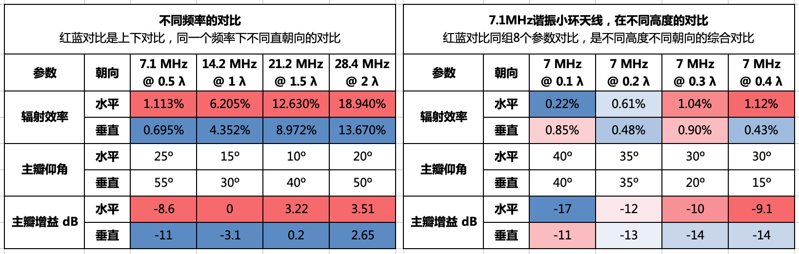

---
aliases:
  - Comparison Analysis of Small Loop Antenna Orientation and Performance Using NEC Models
author:
  - BG6LH
category:
  - 天线
created: 2025-05-24 04:23:19
date: 2019-09-28 22:05:00 +08:00
description: 最近看到一篇KP4MD的文章，用4NEC2仿真，纯理论的模型，测试了小环天线在高层大楼上应用的方向图和性能，并给出了不同频率，和不同高度的两组仿真数据。关键步骤是用了4nec2的patch功能做了一个大号贴片反射器，来模拟她家的大楼外立面。
image: http://mmbiz.qpic.cn/mmbiz_jpg/8havQfBUHowVdRmt5ncetibzao5JpzGIR9Qd74en7lY0icv7tq5wA015d69icpHibfYQmLF2mDDpKzZbhn2SPhWwaA/0?wx_fmt=jpeg
source: https://mp.weixin.qq.com/s/Vrxq-B7eYoXcEbTbtI6apQ
tags:
  - 4NEC2
  - KP4MD
  - NEC2
  - 小环天线
title: 用4NEC2模型测试高楼小环天线
titleSlug: kp4md-4nec2-models-for-balcony-loop
updated: 2025-05-25 06:26:59
---

最近看到一篇KP4MD的文章，用4NEC2仿真软件，纯理论的模型，测试了小环天线在高层大楼上应用的方向图和性能，并给出了不同频率，和不同高度的两组仿真数据对比。关键步骤是用了4nec2的patch功能做了一个大号贴片反射器，来模拟她家的大楼外立面。她的结论是DX应用水平安装好一点，NVIS应用垂直安装更好一点。  

她架天线的环境跟我的非常类似，都是十几层的板式公寓楼，高低上下都基本处在大楼正中间。我曾经想过大楼本身应该是个垂直的“地”，但是没考虑反射器效果，我也挺想用NEC2工具搞一个模型看看。正好KP4MD做了这件事。不同的是她家对面是大海，我家对面30米左右是另一个正好跟我层高一样的矮楼，那我再画一个反射器好吧。

这篇仿真测试的文章不长，有大量的数据和图表可以参考，发表于2015年6月12日KP4MD在的QSL.net的个人主页上的文章《[The Balcony Mounted Magnetic Loop Antenna](https://www.qsl.net/kp4md/balconyloop.htm)》。本文图片均来自原文链接。

我在翻译上一篇 [《AA5TB：](http://mp.weixin.qq.com/s?__biz=MzI0NTgxNDI0NQ==&mid=2247483779&idx=1&sn=5bf876ea2210b6bb6a86676e0373cb8c&chksm=e9498709de3e0e1f91cc34fbfe3fbf2808c59d26b4a3e81d1c008016d715b4e401801becb22c&scene=21#wechat_redirect) [小环发射天线》](http://mp.weixin.qq.com/s?__biz=MzI0NTgxNDI0NQ==&mid=2247483779&idx=1&sn=5bf876ea2210b6bb6a86676e0373cb8c&chksm=e9498709de3e0e1f91cc34fbfe3fbf2808c59d26b4a3e81d1c008016d715b4e401801becb22c&scene=21#wechat_redirect) 时，经常被小环天线朝向的不同说法、零点方向的文字描述搞晕。一直想找个模型文件来再现一下。大好人KP4MD博士(女)在另外一篇文章里提供了一组通用的小环天线NEC2模型文件，有兴趣的可以去下载来自己模拟一下。

73，DE BG6LH
20190927

以下是翻译KP4MD的文章。

---

## 安装在阳台的小环天线——用NEC模型做的小环天线朝向和性能的对比分析

**Dr. Carol F, Milazzo, KP4MD (2015年6月12日)**

 
### 介绍

磁小环天线对于有限空间和移动通联来说是个有用的折衷天线。因此对于住高楼的人来说，磁环天线是个实用的高频天线解决方案。这种条件下不同朝向的性能效果很少有人写过。这个研究用4NEC2\[1\]模型对比分析了装在高楼窗户或阳台栏杆上的磁环天线，朝向的影响，以及方向图和效率。

  

### 模型设计

问题是比较Chameleon CHA F-Loop 天线的性能，直径0.74米(2.44英尺)的辐射环，用DX Engineering的DXE-400 MAX牌的LMR-400同轴馈线做的。分别水平和垂直地安装在一个阳台栏杆上，阳台位于高层公寓建筑的中心附近(图1)。

  

图1，高层公寓楼建筑  

这种情况类似于一个直角的角反射器天线，用地和大楼墙体作为反射器。之前做过这个 天线的验证模型\[2\]，现在把它放在一个20x20格的表面贴片垂直反射器的正中心，反射器尺寸是40x40米(图2)。

  

图2，4NEC2几何模型

天线被放在高于地面正好0.5个7MHz波长、1个14MHz波长等等的 高度 。地面类型被指定为“平均”。天线距离反射器5英尺(1.52米)，电容一边朝向反射器(图3、图4)。 因为NE C代码的局限，想把天线更靠近反射器，但是不行。

  

图3，水平朝向  

图4，垂直朝向  
  

天线在7.1、14.2、21.2和 28.4MHz上测试谐振。这分别对应了0.5、1、1.5和2波长高度(注：这个高度是对应相应频点来说的)。为了观察更低的天线高度的效果，又把7.1MHz谐振天线在0.1、0.2、0.3和0.4波长的离地高度上做了测试。

  

图5，红圈里是磁环天线，很低调  

  

图6，磁环天线，垂直朝向，对着西北方的北美大陆  

  

预测的增益跟真实的增益会不一样，因为模型不能再现天线直接安装在阳台栏杆的情况、也不能反应大楼外墙复杂的反射、或者附近物体和其它表面的反射。NEC的表面贴片提供的精确性略低于用线网画的反射器，但是更容易画，比画线网快四倍\[3\]。不管咋说，这种模型能提供一些不同天线朝向的执行效率和辐射方向图的有用的对比信息。

  
### 数据
每个测试频率下的数据列在下边的大表里，按照以下顺序排列：

1. 4NEC2主屏幕数据（水平朝向）；
2. 4NEC2主屏幕数据（垂直朝向）；
3. 水平朝向上最大增益的方位角辐射方向图；
4. 垂直朝向上最大增益的方位角辐射方向图；
5. 仰角辐射图；
6. 水平朝向的三维辐射方向图；
7. 垂直朝向的三维辐射方向图。

在每个二维辐射方向图上，红线表示水平朝向，蓝线表示垂直朝向。
  
（注，KP4MD把两组测试的4NEC2截图组成了两个4x7的表。在我微信公众号里的翻译是横过来看的，在网页上就没必要这么麻烦了。）

---
### 离地0.5到2个波长对比组

| 7.1 MHz (0.5 λ)                                                                                                                                                                                                                                                                                                                                           | 14.2 MHz (1 λ)                                                                                                                                                                                                                                                                                                                                               | 21.2 MHz (1.5 λ)                                                                                                                                                                                                                                                                                                                                             | 28.4 MHz (2 λ)                                                                                                                                                                                                                                                                                                                                               |
| --------------------------------------------------------------------------------------------------------------------------------------------------------------------------------------------------------------------------------------------------------------------------------------------------------------------------------------------------------- | ------------------------------------------------------------------------------------------------------------------------------------------------------------------------------------------------------------------------------------------------------------------------------------------------------------------------------------------------------------ | ------------------------------------------------------------------------------------------------------------------------------------------------------------------------------------------------------------------------------------------------------------------------------------------------------------------------------------------------------------ | ------------------------------------------------------------------------------------------------------------------------------------------------------------------------------------------------------------------------------------------------------------------------------------------------------------------------------------------------------------ |
| 7.1 MHz Magnetic Loop Antenna Parameters - Horizontal orientation                                         |  14.2 MHz Magnetic Loop Antenna Parameters - Horizontal orientation                                    | 21.2 MHz Magnetic Loop Antenna Parameters - Horizontal orientation                                     | 28.4 MHz Magnetic Loop Antenna Parameters - Horizontal orientation                                     |
| 7.1 MHz Magnetic Loop Antenna Parameters - Vertical orientation                                     | 14.2 MHz Magnetic Loop Antenna Parameters - Vertical orientation                                     | 21.2 MHz Magnetic Loop Antenna Parameters - Vertical orientation                                     | 28.4 MHz Magnetic Loop Antenna Parameters - Vertical orientation                                     |
| 7.1 MHz Magnetic Loop Antenna - Azimuth radiation pattern at 25° elevation | 14.2 MHz Magnetic Loop Antenna - Azimuth radiation pattern at 15° elevation | 21.2 MHz Magnetic Loop Antenna - Azimuth radiation pattern at 10° elevation | 28.4 MHz Magnetic Loop Antenna - Azimuth radiation pattern at 20° elevation |
| 7.1 MHz Magnetic Loop Antenna - Azimuth radiation pattern at 55° elevation | 14.2 MHz Magnetic Loop Antenna - Azimuth radiation pattern at 30° elevation | 21.2 MHz Magnetic Loop Antenna - Azimuth radiation pattern at 40° elevation | 28.4 MHz Magnetic Loop Antenna - Azimuth radiation pattern at 50° elevation |
| 7.1 MHz Magnetic Loop Antenna - Elevation radiation pattern                                                     | 14.2 MHz Magnetic Loop Antenna - Elevation radiation pattern                                                     | 21.2 MHz Magnetic Loop Antenna - Elevation radiation pattern                                                     | 28.4 MHz Magnetic Loop Antenna - Elevation radiation pattern                                                     |
| 7.1 MHz Magnetic Loop Antenna Radiation Pattern - Horizontal orientation                           | 14.2 MHz Magnetic Loop Antenna Radiation Pattern - Horizontal orientation                           | 21.2 MHz Magnetic Loop Antenna Radiation Pattern - Horizontal orientation                           | 28.4 MHz Magnetic Loop Antenna Radiation Pattern - Horizontal orientation                           |
| 7.1 MHz Magnetic Loop Antenna Radiation Pattern - Vertical orientation                                 | 14.2 MHz Magnetic Loop Antenna Radiation Pattern - Vertical orientation                                 | 21.2 MHz Magnetic Loop Antenna Radiation Pattern - Vertical orientation                                 | 28.4 MHz Magnetic Loop Antenna Radiation Pattern - Vertical orientation                                 |

---
### 7.1MHz小环天线离地0.1到0.4波长对比组

|7.1 MHz (0.1 λ)|7.1 MHz (0.2 λ)|7.1 MHz (0.3 λ)|7.1 MHz (0.4 λ)|
|---|---|---|---|
|")7.1 MHz Magnetic Loop Antenna Parameters - Horizontal orientation at 4m (0.1 λ)|")7.1 MHz Magnetic Loop Antenna Parameters - Horizontal orientation at 8m (0.2 λ)|")7.1 MHz Magnetic Loop Antenna Parameters - Horizontal orientation at 12m (0.3 λ)|")7.1 MHz Magnetic Loop Antenna Parameters - Horizontal orientation at 16m (0.4 λ)|
|")7.1 MHz Magnetic Loop Antenna Parameters - Vertical orientation at 4m (0.1 λ)|")7.1 MHz Magnetic Loop Antenna Parameters - Vertical orientation at 8m (0.2 λ)|")7.1 MHz Magnetic Loop Antenna Parameters - Vertical orientation at 12m (0.3 λ)|")7.1 MHz Magnetic Loop Antenna Parameters - Vertical orientation at 16m (0.4 λ)|
| - Azimuth radiation pattern at 40° elevation")7.1 MHz Magnetic Loop Antenna at 4m (0.1 λ) - Azimuth radiation pattern at 40° elevation| - Azimuth radiation pattern at 35° elevation")7.1 MHz Magnetic Loop Antenna at 8m (0.2 λ) - Azimuth radiation pattern at 35° elevation| - Azimuth radiation pattern at 20° elevation")7.1 MHz Magnetic Loop Antenna at 12m (0.3 λ) - Azimuth radiation pattern at 20° elevation| - Azimuth radiation pattern at 15° elevation")7.1 MHz Magnetic Loop Antenna at 16m (0.4 λ) - Azimuth radiation pattern at 15° elevation|
| - Azimuth radiation pattern at 40° elevation")7.1 MHz Magnetic Loop Antenna at 4m (0.1 λ) - Azimuth radiation pattern at 40° elevation| - Azimuth radiation pattern at 35° elevation")7.1 MHz Magnetic Loop Antenna at 8m (0.2 λ) - Azimuth radiation pattern at 35° elevation| - Azimuth radiation pattern at 30° elevation")7.1 MHz Magnetic Loop Antenna at 12m (0.3 λ) - Azimuth radiation pattern at 30° elevation| - Azimuth radiation pattern at 30° elevation")7.1 MHz Magnetic Loop Antenna at 16m (0.4 λ) - Azimuth radiation pattern at 30° elevation|
| - Elevation radiation pattern")7.1 MHz Magnetic Loop Antenna at 4m (0.1 λ) - Elevation radiation pattern| - Elevation radiation pattern")7.1 MHz Magnetic Loop Antenna at 8m (0.2 λ) - Elevation radiation pattern| - Elevation radiation pattern")7.1 MHz Magnetic Loop Antenna at 12m (0.3 λ) - Elevation radiation pattern| - Elevation radiation pattern")7.1 MHz Magnetic Loop Antenna at 16m (0.4 λ) - Elevation radiation pattern|
|")7.1 MHz Magnetic Loop Antenna Pattern - Horizontal orientation at 4m (0.1 λ)|")7.1 MHz Magnetic Loop Antenna Pattern - Horizontal orientation at 8m (0.2 λ)|")7.1 MHz Magnetic Loop Antenna Pattern - Horizontal orientation at 12m (0.3 λ)|")7.1 MHz Magnetic Loop Antenna Pattern - Horizontal orientation at 16m (0.4 λ)|
|")7.1 MHz Magnetic Loop Antenna Pattern - Vertical orientation at 4m (0.1 λ)|")7.1 MHz Magnetic Loop Antenna Pattern - Vertical orientation at 8m (0.2 λ)|")7.1 MHz Magnetic Loop Antenna Pattern - Vertical orientation at 12m (0.3 λ)|")7.1 MHz Magnetic Loop Antenna Pattern - Vertical orientation at 16m (0.4 λ)|

---
### 讨论

预测出来的天线参数

  

这些模型预测显示：

- 在离地0.2波长高度以上，水平朝向小环天线的辐射效率和主瓣增益都会更高。 效率高是意料之中的，因为垂直朝向的一半方向图都指向了地面，被地面吸收了。
- 在更高频率上，辐射方向图的波瓣和零点会增加。
- 在0.5波长高度以上，水平朝向的天线都会屈从于更低角度的最大辐射波瓣，这有利于远距离电离层传播。
- 在0.5波长高度以上，垂直朝向的的天线都会屈从于更高角度的辐射波瓣，在7MHz、55°仰角上会比水平朝向多7dB的信号，有利于短距离近垂直入射天波(NVIS)传播。

  

  

### 结论

  

这个NEC模型对比显示，磁环天线做远距离电离层传播时最好水平朝向，做NVIS传播时最好垂直朝向。实际应用中，天线的最佳朝向也会考虑本地噪声的极化方向。垂直极化的28MHz FM中继就首选垂直朝向。

  

### 参考

\[1\] 4nec2 Antenna Modeling Program, Voors,
https://www.qsl.net/4nec2/

\[2\] Chameleon CHA F-Loop Antenna Parameters, Milazzo, C, KP4MD
https://www.qsl.net/kp4md/chafloop.htm

\[3\] Planar Reflectors: Wire Grid vs. SM Patches, Cebik, L, W4RNL
http://www.antennex.com/w4rnl/col0406/amod98.html

\[4\] A Universal HF Magnetic Loop Model, Milazzo, C, KP4MD
https://www.qsl.net/kp4md/magloop.htm

### 相册(已失效)

1. Balcony Mounted Magnetic Loop Antenna, Milazzo, C, KP4MD
2. Balcony Rail Mount for Magnetic Loop Antenna, Milazzo, C, KP4MD
3. KP4MD/P Amateur Radio Station in Puerto Rico, Milazzo, C, KP4MD

  

### NEC模型参数\[2\]

- 离地高度：69英尺(21.05米)
- 模拟地类型：平均
- 环直径：2.44英尺(0.74米)
- 环周长：92英寸(2.34米)
- 环NEC模型分段：18段
- DXE-400电缆外径：0.405英寸(10.3mm)
- 外皮材料：PVC
- 外编织屏蔽层直径：0.32英寸(8.13mm)
- DXE-400编织层导电率：4500000 mhos/米
- 电容 Q=Xc/Rc：118-1800\*

----

\* 该天线有两个开关位可以切换不同容量，详情请参考原文  

  

### 4NEC2模型文件

不同频率下的天线模型

| 水平 | 垂直 |
| --- | --- |
| [7.1 MHz](balconyloop07h.nec)  | [7.1 MHz](balconyloop07v.nec)  |
| [14.2 MHz](balconyloop14h.nec) | [14.2 MHz](balconyloop14v.nec) |
| [21.2 MHz](balconyloop21h.nec) | [21.2 MHz](balconyloop21v.nec) |
| [28.4 MHz](balconyloop28h.nec) | [28.4 MHz](balconyloop28v.nec) |

7M频率不同高度下的天线模型

| 水平 | 垂直 |
| --- | --- |
|[7 MHz @ 0.1 λ](balconyloop070r1h.nec)|[7 MHz @ 0.1 λ](balconyloop070r1v.nec)|
|[7 MHz @ 0.2 λ](balconyloop070r2h.nec)|[7 MHz @ 0.2 λ](balconyloop070r2v.nec)|
|[7 MHz @ 0.3 λ](balconyloop070r3h.nec)|[7 MHz @ 0.3 λ](balconyloop070r3v.nec)|
|[7 MHz @ 0.4 λ](balconyloop070r4h.nec)|[7 MHz @ 0.4 λ](balconyloop070r4v.nec)|

  

<译完>  

