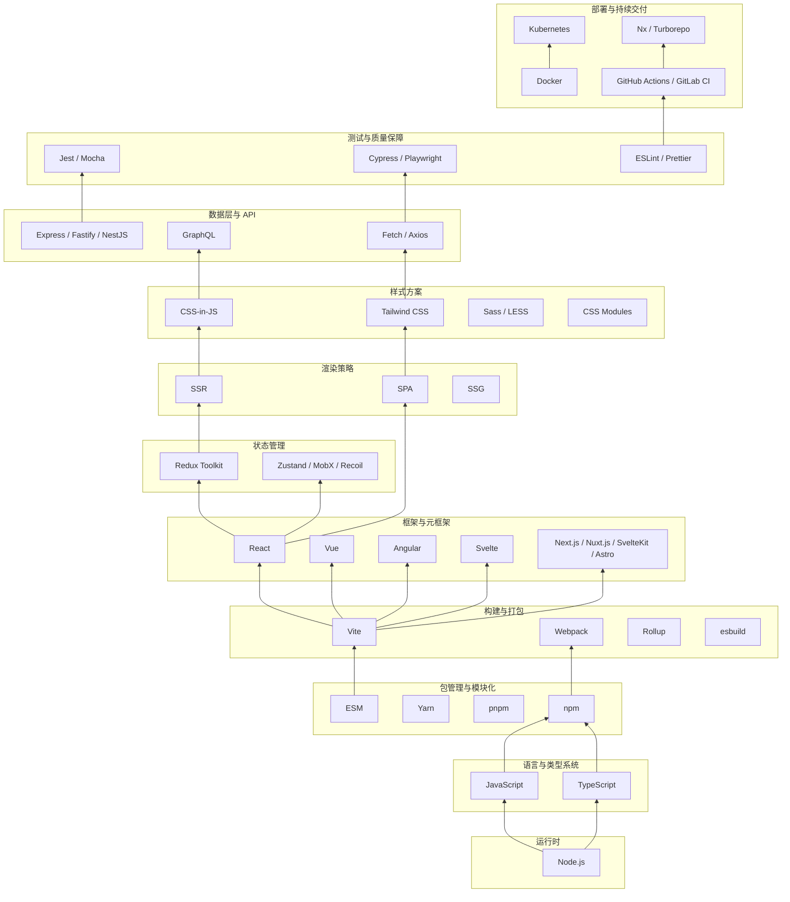

```mermaid
flowchart BT
  %% 声明方向：Top → Bottom :contentReference[oaicite:0]{index=0}
  %% 根节点层：运行时
  subgraph "运行时"
    A[Node.js]
  end

  %% 第一层：语言与类型系统
  subgraph "语言与类型系统"
    B1[JavaScript]
    B2[TypeScript]
  end

  %% 第二层：包管理与模块化
  subgraph "包管理与模块化"
    C1[npm]
    C2[Yarn]
    C3[pnpm]
    C4[ESM]
  end

  %% 第三层：构建工具与打包器
  subgraph "构建与打包"
    D1[Vite]
    D2[Webpack]
    D3[Rollup]
    D4[esbuild]
  end

  %% 第四层：框架与元框架
  subgraph "框架与元框架"
    E1[React]
    E2[Vue]
    E3[Angular]
    E4[Svelte]
    E5[Next.js / Nuxt.js / SvelteKit / Astro]
  end

  %% 第五层：状态管理
  subgraph "状态管理"
    F1[Redux Toolkit]
    F2[Zustand / MobX / Recoil]
  end

  %% 第六层：渲染策略
  subgraph "渲染策略"
    G1[SPA]
    G2[SSR]
    G3[SSG]
  end

  %% 第七层：样式方案
  subgraph "样式方案"
    H1[Tailwind CSS]
    H2[CSS-in-JS]
    H3[Sass / LESS]
    H4[CSS Modules]
  end

  %% 第八层：数据层与 API
  subgraph "数据层与 API"
    I1[Fetch / Axios]
    I2[GraphQL]
    I3[Express / Fastify / NestJS]
  end

  %% 第九层：测试与质量
  subgraph "测试与质量保障"
    J1[Jest / Mocha]
    J2[Cypress / Playwright]
    J3[ESLint / Prettier]
  end

  %% 第十层：部署与交付
  subgraph "部署与持续交付"
    K1[GitHub Actions / GitLab CI]
    K2[Docker]
    K3[Kubernetes]
    K4[Nx / Turborepo]
  end

  %% 各层依赖关系 :contentReference[oaicite:1]{index=1}
  A --> B1
  A --> B2

  B1 --> C1
  B2 --> C1

  C4 --> D1
  C1 --> D2

  D1 --> E1
  D1 --> E2
  D1 --> E3
  D1 --> E4
  D1 --> E5

  E1 --> F1
  E1 --> F2

  F1 --> G2
  E1 --> G1

  G1 --> H1
  G2 --> H2

  H1 --> I1
  H2 --> I2

  I3 --> J1
  I1 --> J2

  J3 --> K1
  K2 --> K3
  K1 --> K4

```